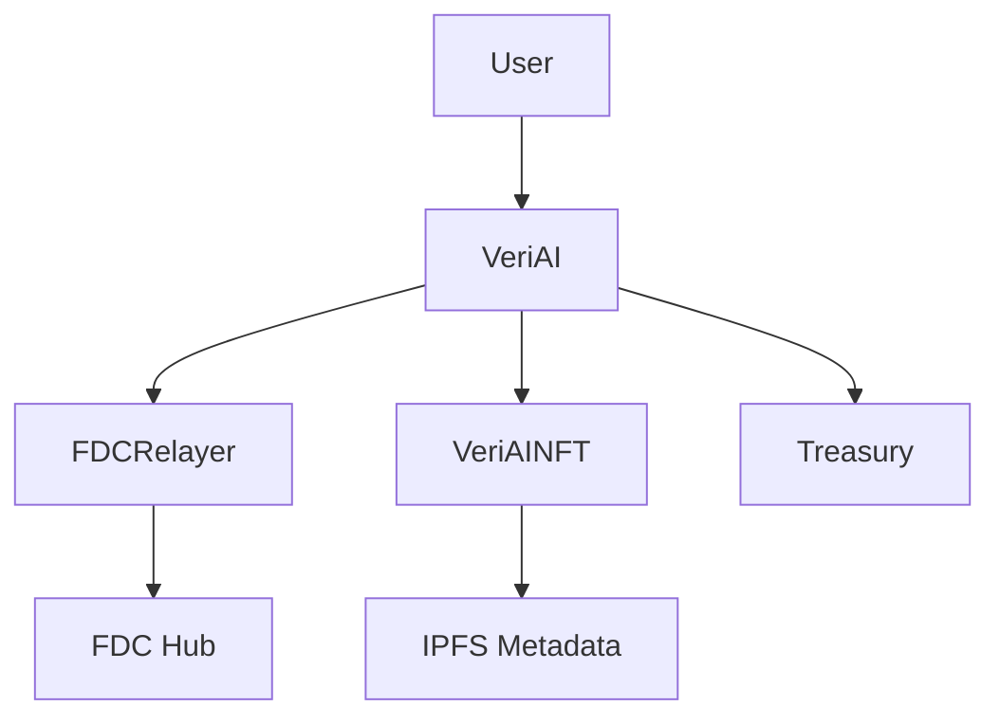

# VeriAI Smart Contracts

## 🚀 Production-Ready Smart Contract Suite for AI Verification on Flare Network

VeriAI is a decentralized AI verification platform that leverages Flare's Data Connector (FDC) technology to provide cryptographic proof of AI model outputs. This contract suite enables transparent, verifiable AI interactions with NFT certification.

## 📋 Contract Architecture

### Core Contracts

| Contract       | Purpose                 | Size       | Features                                              |
| -------------- | ----------------------- | ---------- | ----------------------------------------------------- |
| **VeriAI**     | Main verification logic | 7.251 KiB  | Request verification, manage state, role-based access |
| **VeriAINFT**  | NFT certification       | 13.905 KiB | ERC721 + metadata, proof storage, enumerable          |
| **FDCRelayer** | Flare Data Connector    | 8.563 KiB  | Attestation relay, fee management, retry logic        |

### Contract Interfaces

- **IVeriAI**: Core verification interface
- **IVeriAINFT**: NFT functionality interface
- **IFDCRelayer**: Data connector interface with FDC Hub integration

## 🏗️ Contract Details

### VeriAI.sol

**Main verification contract** - Handles AI verification requests and coordinates with FDC for cryptographic proofs.

**Key Features:**

- ✅ Request verification of AI outputs
- ✅ Role-based access control (Admin, Operator, Pauser)
- ✅ Fee management and treasury integration
- ✅ Request lifecycle management
- ✅ Integration with FDC and NFT contracts
- ✅ Gas-optimized with custom errors
- ✅ Pausable and upgradeable design

**Security:**

- ReentrancyGuard protection
- AccessControl with multiple roles
- Custom error handling for gas efficiency
- Comprehensive input validation

### VeriAINFT.sol

**NFT certification contract** - Mints verification certificates as NFTs with metadata and proof storage.

**Key Features:**

- ✅ ERC721 + ERC721Enumerable implementation
- ✅ Dynamic metadata with IPFS integration
- ✅ Proof hash and verification data storage
- ✅ Royalty support (ERC2981)
- ✅ Batch operations for efficiency
- ✅ Role-based minting controls

**Metadata Structure:**

```json
{
  "name": "AI Verification Certificate #123",
  "description": "Cryptographic proof of AI model output verification",
  "image": "ipfs://QmHash/certificate.png",
  "attributes": [
    { "trait_type": "Model", "value": "GPT-4" },
    { "trait_type": "Verification Date", "value": "2024-12-31" },
    { "trait_type": "FDC Attestation", "value": "0x..." }
  ]
}
```

### FDCRelayer.sol

**Flare Data Connector relay** - Bridges VeriAI with Flare's attestation services.

**Key Features:**

- ✅ FDC attestation request/response handling
- ✅ Automatic retry logic for failed attestations
- ✅ Batch processing capabilities
- ✅ Fee collection and treasury management
- ✅ Request expiry and timeout handling
- ✅ Comprehensive event logging

**Attestation Flow:**

1. Request attestation from FDC Hub
2. Monitor attestation status
3. Retry failed attestations (max 3 attempts)
4. Fulfill successful verifications
5. Update VeriAI contract with results

## 🔧 Technical Specifications

### Development Environment

- **Solidity**: 0.8.20
- **Framework**: Hardhat
- **Dependencies**: OpenZeppelin v5
- **Network**: Flare Network (EVM-compatible)
- **Gas Target**: Optimized for <24KB contract size

### Security Features

- **Access Control**: Role-based permissions
- **Reentrancy Protection**: OpenZeppelin ReentrancyGuard
- **Pausable**: Emergency stop functionality
- **Custom Errors**: Gas-efficient error handling
- **Input Validation**: Comprehensive parameter checking
- **Treasury Protection**: Secure fee collection

### Gas Optimization

- Custom errors instead of require strings
- Efficient storage patterns
- Batch operations support
- Event-driven architecture
- Minimal proxy patterns ready

## 📦 Deployment

### Quick Deploy

```bash
# Install dependencies
npm install

# Compile contracts
npx hardhat compile

# Deploy to local network
npx hardhat run scripts/deploy.ts --network localhost

# Deploy to Flare testnet
npx hardhat run scripts/deploy.ts --network flare-testnet

# Deploy to Flare mainnet
npx hardhat run scripts/deploy.ts --network flare
```

### Configuration

Update deployment script with your parameters:

```typescript
const treasuryAddress = "0xYourTreasuryAddress";
const fdcHubAddress = "0xFlareDataConnectorHub";
```

### Post-Deployment Setup

1. **Verify contracts** on block explorer
2. **Configure FDC providers** with actual Flare addresses
3. **Set up backend API** with deployed contract addresses
4. **Deploy frontend** with Web3 integration
5. **Test end-to-end flow** before production

## 🧪 Testing

```bash
# Run all tests
npx hardhat test

# Run specific test file
npx hardhat test test/VeriAI.test.ts

# Run with gas reporting
REPORT_GAS=true npx hardhat test

# Run with coverage
npx hardhat coverage
```

## 🔐 Security Considerations

### Access Control Roles

**VeriAI Contract:**

- `DEFAULT_ADMIN_ROLE`: Contract administration
- `OPERATOR_ROLE`: Verification operations
- `PAUSER_ROLE`: Emergency pause/unpause

**VeriAINFT Contract:**

- `DEFAULT_ADMIN_ROLE`: Contract administration
- `MINTER_ROLE`: NFT minting (granted to VeriAI)
- `METADATA_UPDATER_ROLE`: Metadata management

**FDCRelayer Contract:**

- `DEFAULT_ADMIN_ROLE`: Contract administration
- `RELAYER_ROLE`: Attestation operations
- `PAUSER_ROLE`: Emergency pause/unpause
- `EMERGENCY_ROLE`: Emergency withdrawals
- `UPDATER_ROLE`: Configuration updates

### Security Best Practices

- All contracts use OpenZeppelin security primitives
- Custom errors for gas efficiency
- Comprehensive input validation
- Reentrancy protection on state-changing functions
- Role-based access control with principle of least privilege
- Emergency pause functionality
- Treasury protection mechanisms

## 📊 Contract Interactions



### Verification Flow

1. User submits verification request to VeriAI
2. VeriAI forwards request to FDCRelayer
3. FDCRelayer requests attestation from FDC Hub
4. FDC provides cryptographic proof
5. VeriAI receives proof and mints NFT certificate
6. User receives NFT with verification metadata

## 🌐 Network Configuration

### Flare Mainnet

- **Chain ID**: 14
- **RPC**: https://flare-api.flare.network/ext/bc/C/rpc
- **Explorer**: https://flare-explorer.flare.network/

### Flare Testnet (Coston2)

- **Chain ID**: 114
- **RPC**: https://coston2-api.flare.network/ext/bc/C/rpc
- **Explorer**: https://coston2-explorer.flare.network/

## 📄 License

MIT License - see [LICENSE](LICENSE) file for details.

## 🤝 Contributing

1. Fork the repository
2. Create a feature branch
3. Add tests for new functionality
4. Ensure all tests pass
5. Submit a pull request

## 📞 Support

- **Documentation**: [VeriAI Docs](https://docs.veriai.app)
- **Discord**: [VeriAI Community](https://discord.gg/veriai)
- **Email**: security@veriai.app

---

**⚡ Built on Flare Network - Powered by Data**
